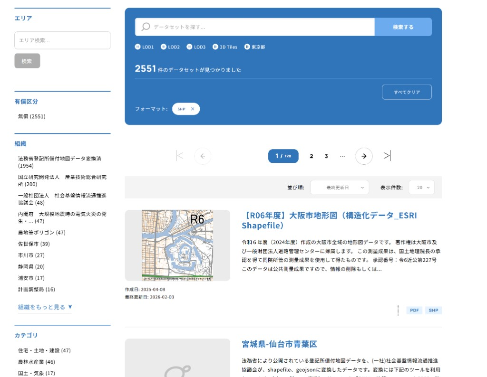

# サンプルデータ選定の趣旨

本プロジェクトの **input_data** で利用している道路区画ポリゴン等は、**【R06年度】大阪市地形図（構造化データ_ESRI Shapefile）** の一部である。このデータセットをサンプルとして採用した趣旨を記録する。

## 選定理由

**G空間情報センター**（[https://www.geospatial.jp/](https://www.geospatial.jp/)）で公開されている **SHP（ESRI Shapefile）形式のオープンデータ** のうち、**もっとも最近更新されたもの** を選んだ。

- 検索条件: フォーマット **SHP**、並び順 **最終更新日**
- その結果、先頭に表示されたデータセットが「【R06年度】大阪市地形図（構造化データ_ESRI Shapefile）」であった。
- 本プロジェクトでは、このデータセットに含まれる **04_道路区画ポリゴンSHP** 等を input_data として利用している。

## データセット情報

- **タイトル**: 【R06年度】大阪市地形図（構造化データ_ESRI Shapefile）
- **URL**: [https://www.geospatial.jp/ckan/dataset/r06-esri-shapefile](https://www.geospatial.jp/ckan/dataset/r06-esri-shapefile)
- **提供**: 大阪府・大阪市・計画調整局
- **内容**: 令和6年度（2024年度）作成の大阪市全域の地形図データ。著作権は大阪市及び一般財団法人道路管理センターに帰属。国土地理院長承認済み（令6近公第227号）。公共測量成果のため利用時は測量法に基づく手続きに注意。
- **作成日**: 2025-04-08
- **最終更新日**: 2026-02-03（選定時点で SHP オープンデータとして最も最近更新）

## 選定時の検索画面（参考）

G空間情報センターで「フォーマット: SHP」「並び順: 最終更新日」で検索した際の画面。同データセットが先頭に表示されている。

---

*本ドキュメントはサンプルデータの選定理由を第三者に説明するために残した記録です。*
