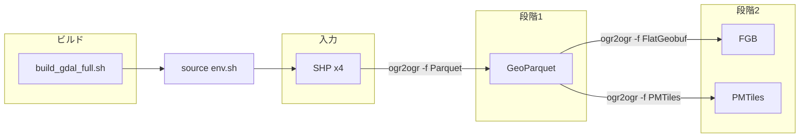

# WSL環境でGDALをビルドしてシェープファイルをGeoParquetに変換し、配信用のFGB/PMTilesを作ってみた

## この記事で学べること

- WSL2（Ubuntu 22.04）上で、Docker や Conda に頼らず GDAL をソースからビルドする手順
- Shapefile から GeoParquet を経由して FGB と PMTiles まで一括変換するパイプラインの作り方
- GeoParquet 出力に必要な Apache Arrow/Parquet のビルドと GDAL への組み込み方
- FGB が 0 件になる「Mismatched geometry type」の原因と、`-nlt PROMOTE_TO_MULTI` などでの対処
- 組織で Docker/Conda が使えない場合の代替としての「隔離ビルド」の考え方

## 想定する対象読者

- 自治体や大企業で、GIS データを GeoParquet や FGB・PMTiles で公開・配信したい担当者
- Docker や Conda が使えない・使いたくない環境で、GDAL で変換パイプラインを組みたい方

## 目次

1. はじめに
2. 本論
   - Shapefile と GeoParquet・配信フォーマットの位置づけ
   - 変換に必要な GDAL と利用方法の選択肢
   - Docker/Conda を使わない理由と隔離ビルドの方針
   - ビルド手順・変換手順・結果・経験したエラーと解決
   - 今後の課題
3. まとめ
4. 参考リンク

## はじめに

行政や企業が公開する大規模なGISデータは、これまで **ESRI Shapefile（.shp）** 形式で配布されることが多かったです。しかし、**配布・公開用** としては Shapefile はあまり好まれません。一方で、**GeoParquet** はデータ分析やクラウドとの相性が良く、**配信用** には **FlatGeobuf（FGB）** や **PMTiles** がよく使われます。

最近は、**OpenHinata** や **いまここ何番地** をはじめ、こうした技術を採用した WebGIS が話題になっています。X（Twitter）で FGB や PMTiles が実際のサービスでどう使われているかを見かけて興味が湧き、**三連休の隙間時間を使って変換のテスト** をしたのでその内容を記事にしました。本記事では、その際に **Windows 上の WSL2（Ubuntu 22.04）** で、Docker や Conda に頼らず **GDAL をソースからビルド** し、Shapefile から GeoParquet へ変換、さらに FGB と PMTiles まで一気に作った手順と、実際にハマったエラーと解決方法をまとめます。

## 本論

### なぜ Shapefile は「配布・公開用」に向かないのか

Shapefile は **原本・アーカイブ用の一次データ** としては今でも広く使われています。一方で、**大規模データの公開・配布用途** としては次のような理由から敬遠されがちです。

- **複数ファイル**（.shp / .dbf / .prj / .shx 等）がセットで必要で、1本だけ渡すと動かない
- **ファイルサイズ上限**（2GB）や **文字コード**（属性の日本語など）の制約
- **Web やクラウドのデータ基盤**（BigQuery、DuckDB、Athena など）とそのまま連携しづらい
- **ストリーミング・部分読み** に不向きで、配信時のパフォーマンスを出しにくい

そのため、「**原本は Shapefile のまま保管し、公開用には GeoParquet や FGB/PMTiles に変換して配る**」という構成が増えています。

### GeoParquet のメリット（三つ）

**GeoParquet** は、ジオメトリを格納した Parquet の仕様で、エコシステムの習熟が進んでいます（[GeoParquet 仕様](https://geoparquet.org/)、GDAL 3.5+、geopandas、Fiona、Cloud optimized な利用など）。大きなメリットは次の三つです。

1. **原本との完全一致を検証しやすい**  
   行数（フィーチャ数）やスキーマを比較すれば、変換の取りこぼしやスキップの有無を確認できます。Shapefile と 1:1 で件数が一致するかを `ogrinfo` などで簡単にチェックできます。

2. **分析・BI ツールとの親和性が高い**  
   Pandas、DuckDB、BigQuery、Athena、Spark など、Parquet をネイティブに扱うツールが多く、**そのまま空間クエリや集計** がしやすいです。Shapefile をいちいち読み込むよりワークフローがシンプルになります。

3. **ストレージ効率と部分読み**  
   圧縮（Snappy 等）が効き、列指向のため必要な列だけ読めます。クラウドストレージや CDN と組み合わせて **必要な範囲だけ取得** するような使い方にも向いています。

### 配信用には FGB と PMTiles

**配信・可視化** を目的にする場合、次の二つがよく使われます。

- **FlatGeobuf（FGB）**  
  単一ファイルでベクタデータを保持し、**空間インデックス** により必要な範囲だけを効率よく読み出せます。MapLibre GL JS などでそのまま表示でき、配信用のベクタタイルの代替として利用されます。

- **PMTiles**  
  ベクタタイル（またはラスタタイル）を **1 ファイル** にまとめた形式です。HTTP で範囲リクエスト（Range リクエスト）に対応したサーバに置くだけで、マップビューアでズーム・パンに応じたタイル配信ができます。PMTiles プロトコル対応のビューアや MapLibre のプラグインで利用できます。

どちらも **1 ファイルで完結** し、従来のタイルサーバを立てずに配信できるため、自治体や社内の簡易公開に向いています。一方で、FGB と PMTiles にはそれぞれ一長一短があり、たとえば間引き（ generalization ）による精度のトレードオフや表示速度・データ量との兼ね合いなど、フォーマット選定時には専門的な検討が必要です。それらの比較や使い分けは本記事の範囲を超えるため、ここでは割愛し、詳しくは他の文献や実装例に譲ります。

### 変換には GDAL が必要

Shapefile から GeoParquet、FGB、PMTiles を生成するには **GDAL**（`ogr2ogr`）が使えます。GDAL はオープンソースの地理空間データ変換ライブラリで、多数のフォーマットをサポートしています。ただし、**Parquet / FlatGeobuf / PMTiles** は「オプショナル」なドライバに分類されており、**ビルド時に依存ライブラリを入れておかないと使えません**。とくに GeoParquet 出力には **Apache Arrow C++ / Parquet C++** が必須です。

### GDAL の利用方法の選択肢

GDAL を使う方法としては、例えば次のようなものがあります。

- **OS のパッケージ**（`apt install gdal-bin` など）  
  手軽だが、バージョンや有効なドライバが固定され、Parquet が無効だったり古かったりすることがある。
- **Python の wheel（.whl）**  
  Windows 用の wheel を入れて Python から使う方法。環境によってはビルド済みのものがなく、依存のバージョンで詰まることがある。
- **OSGeo4W（Windows）**  
  Windows 向けの GDAL 配布。インストールやパスの扱い、Parquet などのオプション有無が環境依存になりがち。
- **ソースからビルド**  
  必要なドライバ（Parquet, FlatGeobuf, PMTiles）を有効にしたうえで、再現性のある環境を自分で作れる。

**Windows 単体** では、.whl や OSGeo4W で試したがうまくいかない・Parquet が使えない、といった話はよくあります。また、GDAL のビルドは **Linux の方が情報が多く、相性も良い** ことが多いです。そこで今回は **Windows 上の Linux 環境である WSL2（Ubuntu 22.04）** で、**ソースからビルド** する方法を採用しました。

### Docker や Conda を使わなかった理由

WSL 上でも、**Docker や Conda で GDAL を入れる** 選択肢はあります。しかし、**大きな組織に所属していると、次のような制約** で使えない・使いたくない場合があります。

- **Docker**  
  大規模組織や商用利用では **Docker Desktop の有償契約** が必要になることがある。また、社内ポリシーで **コンテナ利用が禁止** または **イメージの事前承認** が必要な場合がある。
- **Conda（Anaconda 等）**  
  **従業員数 200 人超** など一定規模以上の組織では、**Anaconda の商用利用で有償契約** が必要になることがある。そのため、Conda 利用を禁止・制限している企業がある。

こうした制約がなければ、自治体の担当者や大企業の開発者でも、**ライセンスやポリシーを気にせず GDAL を利用** しやすくなります。そこで今回は **Docker にも Conda にも依存せず**、WSL 上の Ubuntu で **apt とソースビルドのみ** で完結させる構成にしました。

### 方針：シンプルに「隔離ビルド」

今回は次のようにしました。

- **1 つのディレクトリ**（例: `gdal-full`）の直下に、GDAL のソース・ビルド成果物・インストール先をすべて置く。
- **Parquet 用の依存（Arrow/Parquet）** も、同じディレクトリの直下（`arrow-src` / `arrow-build` / `arrow-install`）にビルドして置く。
- そのディレクトリを削除すれば、**GDAL も Arrow もまとめて消える**（システムにインストールしない）。

こうすると、「**どこに何が入っているか**」が明確で、**第三者や別マシンでも手順どおりに再現** しやすくなります。

### GDAL だけでは足りない：追加の依存

GDAL をビルドするだけでは、**GeoParquet の出力** はできません。GDAL の Parquet ドライバは **Apache Arrow C++** と **Apache Parquet C++** に依存しており、これらが CMake で検出されていないと Parquet ドライバは無効になります。そのため、今回の手順では次の二段構えにしています。

1. **Arrow C++ をソースからビルド** し、`arrow-install` にインストールする（`ARROW_PARQUET=ON` で Parquet を含める）。
2. **GDAL をビルド** するときに、`CMAKE_PREFIX_PATH` で `arrow-install` を指定し、Parquet ドライバを有効にする。

FlatGeobuf と PMTiles は、GDAL の標準ビルドに含まれることが多いので、Arrow/Parquet を入れておけば、**SHP → GeoParquet → FGB / PMTiles** まで GDAL だけで完結します。

**メリット**  
- 変換パイプラインが **GDAL のみ** で統一できる。  
- Python や Node などの実行環境に依存しない。  
- シェルスクリプトでバッチ化しやすい。

**デメリット**  
- Arrow のビルドに **C++17/20、gcc-12、CMake 3.25+** などが必要で、初回の環境準備に時間がかかる。  
- ビルド用のディスク容量（数 GB 程度）が必要。

### 開発環境の諸元

本記事で実際にビルド・変換を実行した環境は以下のとおりです。

- **OS**: Windows 11 Pro（64bit）
- **CPU**: 13th Gen Intel(R) Core(TM) i9-13900H (2.60 GHz)
- **メモリ**: 64.0 GB (63.7 GB 使用可能)
- **GPU**: NVIDIA GeForce RTX 4070 Ti
- **WSL**: WSL2、ディストリビューション **Ubuntu 22.04**

GDAL のビルドとパイプラインの実行はすべて WSL 内の Ubuntu で行っています。

### ビルド手順

#### 1. 事前準備（WSL 上の Ubuntu 22.04）

```bash
sudo apt-get update
sudo apt-get install -y build-essential cmake git curl ninja-build
# Arrow の C++20 ビルド用（推奨）
sudo apt-get install -y gcc-12 g++-12
```

Ubuntu 22.04 の標準 CMake は 3.22 前後のため、Arrow の最新版では **CMake 3.25+** が必要になる場合があります。そのときは [Kitware APT](https://apt.kitware.com/) で CMake を追加するか、Arrow の **12.x や 14.x** など、少し古いリリースを選ぶと標準 CMake でビルドできることがあります。

#### 2. Arrow C++ のビルドとインストール

プロジェクトルート（例: `gdal-full`）で、Arrow をソースから取得・ビルドし、`arrow-install` にインストールします。

```bash
cd /path/to/gdal-full
chmod +x build_arrow.sh
./build_arrow.sh
```

- 初回は Apache Arrow のソース（例: 14.0.2）を取得し、`arrow-src/`・`arrow-build/` でビルド、`arrow-install/` にインストールします。
- `arrow-install/lib/cmake/Arrow` と `arrow-install/lib/cmake/Parquet` が存在すれば成功です。
- 既に `arrow-install` がある場合はスキップする実装にしておくと、再実行が楽です。

#### 3. GDAL のビルド

`build_gdal_full.sh` で、`arrow-install` を `CMAKE_PREFIX_PATH` に含めつつ、GDAL をクリーンビルドします（既存の `gdal-build` は削除してからやり直す想定）。

```bash
cd /path/to/gdal-full
./build_gdal_full.sh
```

ビルド後、次で Parquet が有効か確認します。

```bash
source env.sh
ogrinfo --formats | grep -E "Parquet|FlatGeobuf|PMTiles"
```

**Parquet** / **FlatGeobuf** / **PMTiles** が表示されていれば、変換パイプラインに必要なドライバは揃っています。`env.sh` では `arrow-install/lib` を `LD_LIBRARY_PATH` に追加しているので、実行時に libparquet 等が読み込まれます。

### 変換手順

パイプラインの全体像は次のとおりです。ビルド後に `source env.sh` で GDAL を有効化し、各 SHP を GeoParquet に変換したうえで、同一の Parquet から FGB と PMTiles を生成します。



入力は **Shapefile が入ったディレクトリ**（例: `input_data/`）とし、次のような 1 本のシェルスクリプトでまとめて変換します。

1. **SHP → GeoParquet**  
   `ogr2ogr -f Parquet -lco GEOMETRY_ENCODING=WKB output_data/<ベース名>.parquet input_data/<ベース名>.shp`
2. **GeoParquet → FGB**  
   `ogr2ogr -f FlatGeobuf -nlt PROMOTE_TO_MULTI -lco SPATIAL_INDEX=NO output_data/<ベース名>.fgb output_data/<ベース名>.parquet`
3. **GeoParquet → PMTiles**  
   `ogr2ogr -dsco MINZOOM=0 -dsco MAXZOOM=15 -f "PMTiles" output_data/<ベース名>.pmtiles output_data/<ベース名>.parquet`

スクリプト内で `source env.sh` してから上記を `input_data/*.shp` の各レイヤに対してループで実行します。出力は `output_data/` に `<ベース名>.parquet` / `.fgb` / `.pmtiles` として出します。

実行例:

```bash
cd /path/to/gdal-full
./scripts/run_pipeline.sh
```

### 変換結果（サンプルデータ）

今回のサンプルでは、[G空間情報センター](https://www.geospatial.jp/) の「【R06年度】大阪市地形図（構造化データ_ESRI Shapefile）」の **道路区画ポリゴン** の一部（トンネル・庭園路・真幅道路・高速道路の 4 レイヤ）を使いました。CRS は JGD2011 平面直角 VI 系（EPSG:6674）です。

| レイヤー           | フィーチャ数 | Parquet | FGB | PMTiles |
|--------------------|-------------|---------|-----|---------|
| トンネルポリゴン   | 8           | 一致    | 一致 | 一致    |
| 庭園路ポリゴン     | 3,782       | 一致    | 一致 | 一致    |
| 真幅道路ポリゴン   | 80,800      | 一致    | 一致 | 一致    |
| 高速道路ポリゴン   | 666         | 一致    | 一致 | 一致    |

入力と出力のフィーチャ数は、`ogrinfo -so -al` で取得した Feature Count で比較し、すべて一致することを確認しています。

### 経験したエラーと解決方法

#### 1. Parquet ドライバが無い

**症状**: `ogrinfo --formats` に Parquet が表示されない。`run_pipeline.sh` で「Parquet is not available」で終了する。

**原因**: GDAL のビルド時に Arrow/Parquet が検出されていない。

**対応**: Arrow C++ を `ARROW_PARQUET=ON` でビルドし、`arrow-install` にインストール。GDAL のビルド時に `CMAKE_PREFIX_PATH` に `arrow-install` を指定し、既存の `gdal-build` を削除してから再ビルドする。

#### 2. FGB が 0 件になる（Mismatched geometry type）

**症状**: GeoParquet → FGB の変換後、`ogrinfo` で Feature Count が 0 になるレイヤがある。ログに「Mismatched geometry type」が出る。

**原因**: Shapefile は Polygon と MultiPolygon を区別せず「Polygon」と宣言することがある一方、FlatGeobuf ドライバは **Polygon と MultiPolygon を別型** として扱う。Parquet に Polygon/MultiPolygon が混在していると、FGB 書き出し時に型不一致でフィーチャがスキップされ、結果として 0 件になる（[GDAL #2828](https://github.com/OSGeo/gdal/issues/2828)）。

**対応**:  
- `ogr2ogr` に **`-nlt PROMOTE_TO_MULTI`** を付与し、出力レイヤを MultiPolygon に統一する。  
- NULL ジオメトリを含むレイヤでは、FGB の **`-lco SPATIAL_INDEX=NO`** を付与する（SPATIAL_INDEX=YES のときは NULL ジオメトリ非対応のため）。

これで全レイヤで FGB のフィーチャ数が入力と一致することを確認しています。

#### 3. 一部レイヤで「Mismatched geometry type」警告（Parquet 出力時）

**症状**: SHP → GeoParquet のときに「Mismatched geometry type」という警告が出ることがある。

**補足**: Parquet 出力については、今回の 4 レイヤすべてで **入力とフィーチャ数が一致** しており、データとしては問題ありません。警告はジオメトリ型の扱いに関するもので、FGB 側で `-nlt PROMOTE_TO_MULTI` を付けることで、後段の FGB が 0 件になる問題を解消しています。

### 今後の課題

- **CI でのビルド**: Arrow / GDAL のビルド時間が長いため、CI ではキャッシュや事前ビルド済みバイナリの利用を検討したい。
- **他フォーマット**: GeoPackage（.gpkg）など、同じパイプラインで出力を増やせるか検討の余地あり。
- **大容量レイヤ**: 真幅道路ポリゴン（約 8 万フィーチャ）程度では問題なかったが、さらに大きなデータではメモリやタイムアウトの確認が必要。
- **ドキュメントの自立**: 手順や「Docker/Conda を使わない理由」を、第三者や自治体担当者が読みやすい形で README や docs に残しておく。

#### 試してみたいテーマ：PostgreSQL（PostGIS）からの変換（実装済み）

PostgreSQL + PostGIS にリストアしたダンプを入力に、**同じ GDAL パイプライン**（GeoParquet 中継 → FGB / PMTiles）で変換するスクリプトを用意しました。

- **スクリプト**: `scripts/run_pipeline_pg.sh`。接続文字列は環境変数 `PG_CONNECTION` または第1引数で指定する（デフォルトは書かず、本番 DB への誤接続を防ぐ）。
- **手順**: ダンプのリストア方法、PostgreSQL ドライバの確認・有効化、対象レイヤの扱い、ジオメトリ型・CRS・大容量時の注意は [docs/pipeline_pg.md](pipeline_pg.md) に記載している。

上記ドキュメントを参照して利用できる。

## まとめ

WSL2 上の Ubuntu で、Docker や Conda に頼らずに GDAL と Arrow をビルドし、Shapefile から GeoParquet と配信用の FGB・PMTiles まで一通り出力する手順をまとめました。組織のライセンスやポリシーで Docker/Conda が使えない場合でも、同じ方針で再現できるようにしています。実際にハマった FGB の 0 件問題は、`-nlt PROMOTE_TO_MULTI` と `-lco SPATIAL_INDEX=NO` で解消できるので、同様の変換を試す際の参考にしてもらえれば幸いです。

## 参考リンク

- [GeoParquet 仕様](https://geoparquet.org/)
- [GDAL (Geo)Parquet ドライバ](https://gdal.org/drivers/vector/parquet.html)
- [GDAL FlatGeobuf ドライバ](https://gdal.org/en/stable/drivers/vector/flatgeobuf.html)
- [GDAL PMTiles ドライバ](https://gdal.org/drivers/vector/pmtiles.html)
- [OSGeo/gdal#2828 — Shapefile to FlatGeobuf, mixed Polygon/MultiPolygon](https://github.com/OSGeo/gdal/issues/2828)
- [G空間情報センター — 【R06年度】大阪市地形図（構造化データ_ESRI Shapefile）](https://www.geospatial.jp/ckan/dataset/r06-esri-shapefile)
